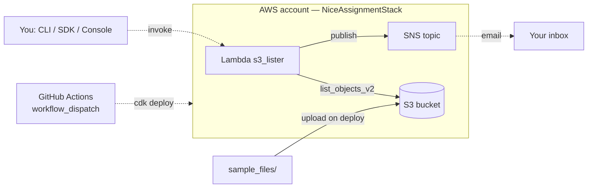

# S3 Lister app

A small serverless app on AWS for a DevOps assignment at NiCE. It creates an S3 bucket, uploads some local files into it during deployment, and runs a Lambda function (`s3_lister`) that lists the objects in the bucket and emails the list through SNS.

The only steps outside the code are creating the first set of credentials — I used an IAM user;
IAM Identity Center is the option AWS recommends, but its account instances do not support
permission sets, so a user was simpler here — and confirming the SNS subscription, which AWS
requires by design.



## Layout of the project
```
.github/workflows/deploy.yaml     manual deployment pipeline
events/test-event.json            payload for manual invocation
lambda/index.py                   Lambda function
nice_assignment/                  CDK stacks
  github_oidc_stack.py            OIDC provider + deploy role for CI pipeline
  nice_assignment_stack.py        bucket, SNS, IAM role, Lambda
sample_files/                     files uploaded to the bucket
scripts/invoke_lambda.py          invoke via boto3, print and save logs
tests/
  conftest.py                     puts lambda/ on the import path, sets test env
  unit/                           tests for the stack and the handler
app.py                            AWS CDK entry point for both stacks
cdk.json                          tells the CDK CLI how to run app.py
requirements.txt                  runtime and deployment dependencies
requirements-dev.txt              adds pytest and moto on top
```

## Deploy
Needs Python 3.13, Node.js 22 (the CDK CLI runs on Node), and a configured AWS CLI.

```bash
npm install -g aws-cdk
cdk bootstrap aws://<ACCOUNT_ID>/<REGION>     # once per account/region

python -m venv .venv
source .venv/bin/activate                     # for Windows: .venv\Scripts\activate.bat
pip install -r requirements.txt

cdk deploy NiceAssignmentStack -c notification_email=you@example.com    
```

### Confirm the email

AWS sends **"AWS Notification - Subscription Confirmation"** after the first deployment. Click **Confirm subscription** — and check the spam folder, it usually lands there. 

You must click the confirmation link sent to your email (expires in 3 days). Until you do, SNS silently drops all notifications. Your Lambda will succeed, but no email will show up.

Check your status:

```bash
aws sns list-subscriptions-by-topic --topic-arn <TopicArn from outputs>
```

`SubscriptionArn` should be a real ARN, not `PendingConfirmation`.

Later deployment needs no arguments
```bash
cdk deploy NiceAssignmentStack
```

The email address is written to AWS SSM Parameter Store on the first deployment and read back afterwards. That is why no email address appears anywhere in this repo.

The first deployment must supply the address: `-c notification_email=` locally, or the
`NOTIFICATION_EMAIL` secret in CI. Without it CDK fails with
`SSM parameter not available in account ... /nice-assignment/notification-email` - that means
the parameter has not been created yet, not that your credentials are wrong.

Changing the address later replaces the SNS subscription (its logical ID is derived from the
email), so a new confirmation message will arrive. Clear the local cache first:
`cdk context --clear`.

## Invoking the Lambda function by hand

Three ways, all hitting the same API.

```bash
# 1. AWS CLI
aws lambda invoke --function-name s3_lister \
  --cli-binary-format raw-in-base64-out \
  --payload file://events/test-event.json \
  response.json

# 2. boto3 script — also prints CloudWatch logs, fills invoke.log and exits non-zero on failure
python scripts/invoke_lambda.py
```
3. AWS Console: Lambda -> `s3_lister` -> Test -> paste `events/test-event.json` -> Test.

After the invoke of Lambda function via AWS Console, you will see on your screen (if the function ran correctly):


`--cli-binary-format raw-in-base64-out` is required in AWS CLI v2, otherwise you get `Invalid base64`.

**Success** means `object_count` matches the number of files in the bucket and an email arrives with
the subject `S3 notification from <bucket>`. Note that `StatusCode: 200` does not mean the
function worked - it only means the request reached Lambda. A crash shows up as a `FunctionError`
field in the response, which is what the script and the pipeline check.

```bash
aws logs tail /aws/lambda/s3_lister --since 10m --follow
```

Example of logs in AWS CLI:


## Tests

```bash
pip install -r requirements-dev.txt
pytest -q
```

No AWS credentials are required. The stack tests synthesize the CloudFormation template in memory, and the handler tests replace S3 and SNS with `moto`.

**Infrastructure (`test_nice_assignment_stack.py`)**
Ensures the S3 bucket is strictly private and encrypted, and verifies the Lambda function is attached to our exact least-privilege IAM role with no `Resource: "*"` wildcards.

**Business Logic (`test_handler_lambda.py`)**
Tests the Python handler using mocked S3 and SNS clients. It covers edge cases like S3 pagination (handling >1000 objects), empty buckets, total size calculations, and what actually gets published to SNS.

**Robustness**
The test suite is verified against deliberate breakage. Removing the S3 paginator, detaching the custom IAM role, or adding overly broad permissions will immediately fail the respective tests.

## CI/CD

`.github/workflows/deploy.yaml` runs on `workflow_dispatch` - a button in the Actions tab, not on
every push. It authenticates with GitHub OIDC federation, so no AWS keys are stored in GitHub Secrets: GitHub gives a
short-lived token per run and AWS trades it for temporary credentials.

Two stacks, deployed by different parties:

| Stack | Deployed by | Credentials |
|---|---|---|
| `GitHubOidcStack` | you, once, locally | your own |
| `NiceAssignmentStack` | every run, GitHub Actions | the OIDC role |

**Pipeline Security Model**
The CI pipeline role has no permissions to create AWS resources directly; deployment is handled entirely by assuming CDK bootstrap roles. The pipeline role itself is strictly limited to exactly what the smoke test needs: `s3:ListBucket` on the specific bucket and `lambda:InvokeFunction` on the lister function. 

*Security Note:* While this approach safely avoids storing admin keys in GitHub, it is not a complete hard boundary. The underlying CloudFormation role (`cdk-hnb659fds-cfn-exec-role-*`) still operates with default `AdministratorAccess`. In a strict production setup, the account would be re-bootstrapped with `--cloudformation-execution-policies` to restrict these permissions.

Setup:

```bash
cdk deploy GitHubOidcStack -c github_repo=<owner>/<repo>
```

On a brand-new account the SSM parameter does not exist yet, and `cdk` synthesizes the whole app
before picking which stack to deploy — so `NiceAssignmentStack` is built too and its lookup fails.
The very first command needs the email as well:

```bash
cdk deploy GitHubOidcStack -c github_repo=<owner>/<repo> -c notification_email=you@example.com
```

Once `NiceAssignmentStack` has been deployed once, the address lives in SSM and later commands
need neither argument.

If the account already has a GitHub OIDC provider, `cdk deploy` fails with `EntityAlreadyExists`.

Put `DeployRoleArn` from the outputs into the GitHub Secrets as `AWS_DEPLOY_ROLE_ARN`, and the
region into the variable `AWS_REGION`. Then Actions -> **Deploy Serverless Stack** -> **Run workflow**.

The pipeline runs the unit tests first and only deploys if they pass, so a broken template never reaches AWS. After deploying it checks that the files actually reached the bucket, invokes the Lambda, and writes the outputs and the response into the run summary.


### GitHub Secrets / Variables
| Where | Name | Value |
|---|---|---|
| Secrets | `AWS_DEPLOY_ROLE_ARN` | `DeployRoleArn` from the stack outputs |
| Secrets | `NOTIFICATION_EMAIL` | only needed if the stack was never deployed before |
| Variables | `AWS_REGION` | e.g. `eu-central-1` |

## Design decisions

**OIDC Authentication instead of access keys** 
I use temporary OIDC tokens instead of permanent AWS keys. If a static key leaks, hackers get access forever. I also locked the AWS role to this exact repository so no other GitHub user can use it.

**Separated CI/CD and App Stacks**
The GitHub OIDC stack is deployed once, while the application stack redeploys on every run.
Keeping them apart means the pipeline never needs permission to create IAM resources — that
happens through the bootstrap roles it assumes. See the security note above for where that
boundary actually ends.

**Keeping emails out of public code**
I use AWS SSM to manage the notification email. By passing it once via the CLI `-c notification_email=`, I avoid hardcoding personal data into a public repository. AWS stores it as a plain `String` parameter; while it's not a strict secret requiring a `SecureString`, it still belongs in the cloud, not in version control. Additionally, `cdk.context.json` is added to `.gitignore` to prevent accidental leaks of this local cache.

**Explicit IAM Statements vs CDK Helpers**
Using `grant_read()` requires less typing, but it violates the principle of least privilege by generating overly permissive policies. By writing explicit IAM statements, I ensure the Lambda function gets exactly what it needs and nothing more: list the bucket, publish to one topic, and write to its own log group. There are no managed policies and no `Resource: "*"`.

**No `s3:GetObject`** 
`list_objects_v2` already returns key, size and timestamp, so file contents are never read. Granting it would be a 
violation of the principle of least privilege.

**`RemovalPolicy.DESTROY`** 
Fine for a test project, since `cdk destroy` then cleans up fully. In
anything real this should be `RETAIN` - otherwise deleting the stack silently deletes the data.

**Offline Unit Tests Only**
I test the synthesized template and Lambda logic entirely offline. There are no integration tests that deploy to a real AWS account. Spinning up live resources just for testing takes unnecessary time and money for a simple 3-resource stack, especially since the CI/CD pipeline already includes a smoke test to verify the live deployment.

## Tools

AWS CDK v2 (Python), Python 3.13, boto3, GitHub Actions with OIDC, pytest and moto for tests.

**Choosing CDK:** 
Besides following the assignment's guidelines, CDK's use of Python is a huge benefit. By referencing the S3 bucket and SNS topic objects directly in the Lambda's environment variables, the framework automatically handles resource linking. This completely eliminates manual synchronization of ARNs and names.

## Cleanup

```bash
cdk destroy NiceAssignmentStack
```

`GitHubOidcStack` can stay — it costs nothing and stores no data.

## Known limitations

**One environment** 
For the scope of this assignment, resource names (e.g., `s3_lister`, `lister-lambda-role`) are explicitly defined. Deploying a second stack in the same AWS account will cause naming collisions. In a real-world production scenario, I would isolate environments (dev/prod) by deploying them into completely separate AWS accounts, rather than polluting resource names with environment suffixes.

**GitHub changed the OIDC subject format**
Since 15 July 2026 new repositories get immutable IDs in
the `sub` claim (`repo:owner@123456/repo@789012:...`). A trust policy written for the old format
rejects everything with `Not authorized to perform sts:AssumeRoleWithWebIdentity`, which looks
exactly like a missing role. The policy here matches both formats (initially the policy was written for the old format; the pipeline run surfaced the change).

**Region coupling**
The OIDC role's policy is scoped to the region where `GitHubOidcStack` was deployed. If `vars.AWS_REGION` in GitHub points somewhere else, the role is still assumable but the deploy fails while reading the CDK bootstrap version, and the smoke test would fail with AccessDenied. Both stacks and the variable must point at the same region.

**The trust policy matches any ref**
The trust policy currently allows any branch or tag `(:*)`. This is safe for now because the workflow is manual (`workflow_dispatch`) and it helps with debugging. For stricter security, I should eventually restrict it to the main branch or a prod environment.

**SSM Parameter synth-time lookup**
The application stack both creates and reads the `/nice-assignment/notification-email` parameter, causing a cycle during offline `cdk synth`. A separate config stack would fix this, but I intentionally kept the single-stack design. This allows the entire project to be deployed with one command and ensures a safe failure mode (i.e., `cdk deploy` loudly refuses to run rather than silently deploying a dummy placeholder).